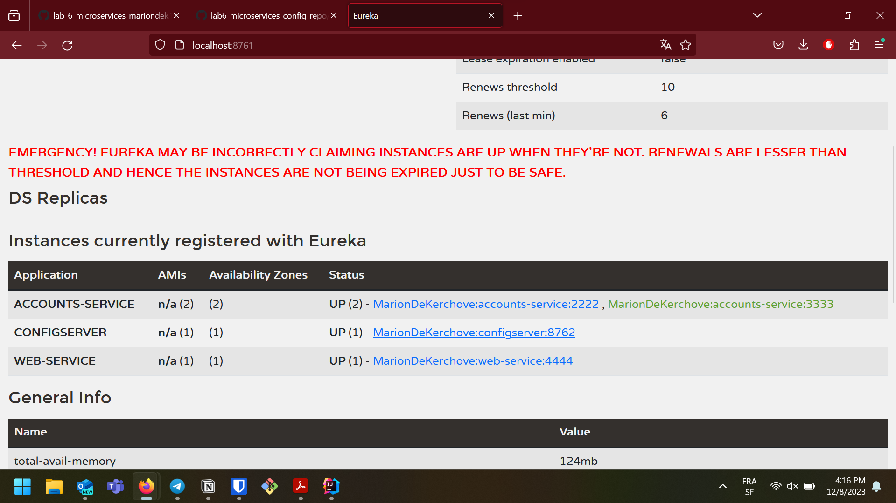
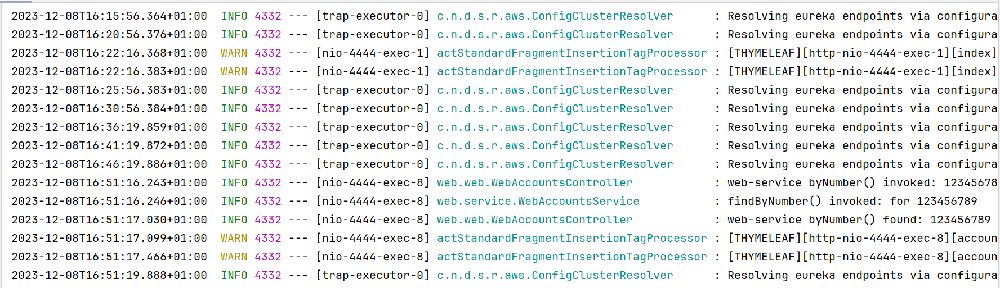
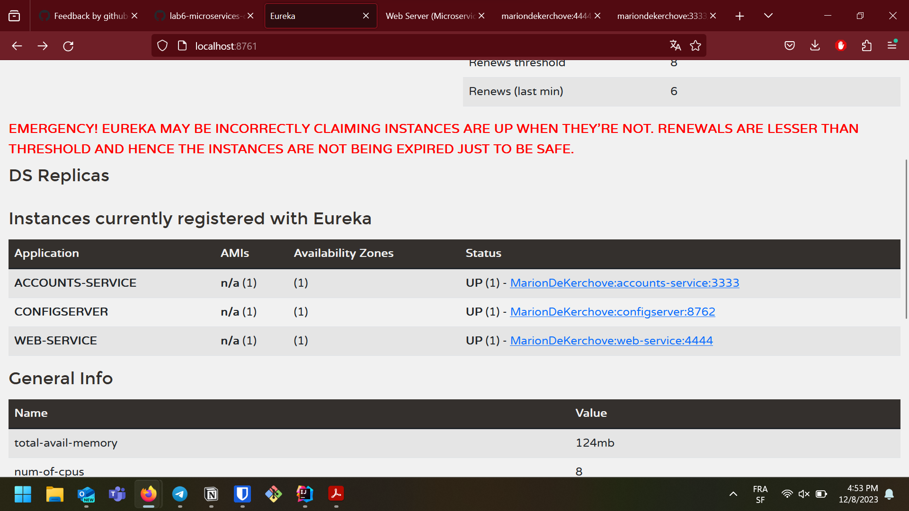
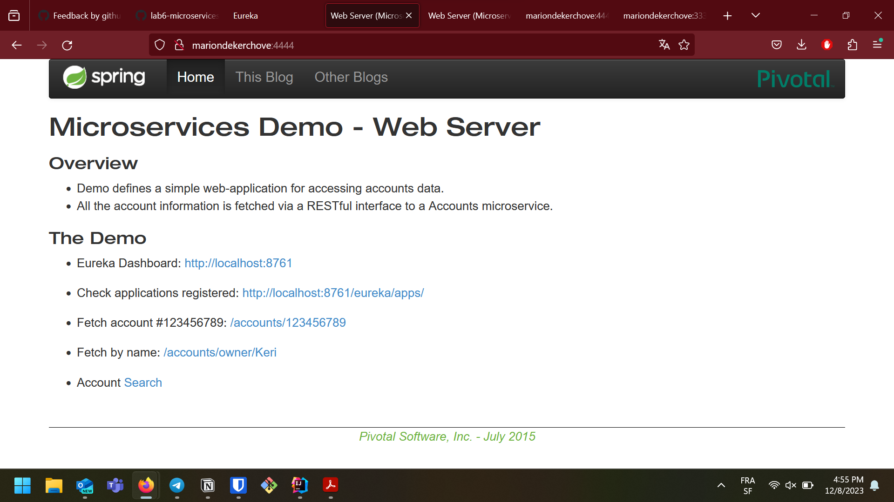

Link to repo https://github.com/mariondek10/lab6-microservices-config-repo

)
Link to commit 3333 https://github.com/mariondek10/lab6-microservices-config-repo/commit/bfe528feaa9158c881d6269298f44ca5757e0f68

**Explaination** 
Ther are two accounts server running on two different ports. But they give the exact same information.

The requests still go through but with a warning message.

The second port doesn't appear on the dashboard anymore nor does it work. 

But the webserver still works and can provide information about the accounts.