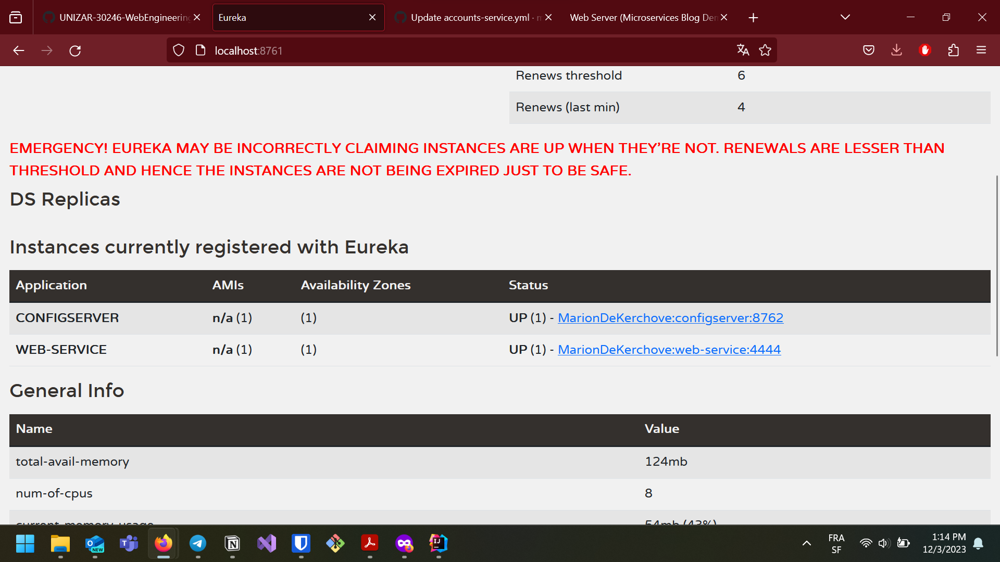

Link to repo https://github.com/mariondek10/lab6-microservices-config-repo

)
Link to commit 3333 https://github.com/mariondek10/lab6-microservices-config-repo/commit/bfe528feaa9158c881d6269298f44ca5757e0f68

**Explaination** 
The account service can't run on both ports. 

It can't take the requests without the account server running. But the eureka dashboard stays the same. 
